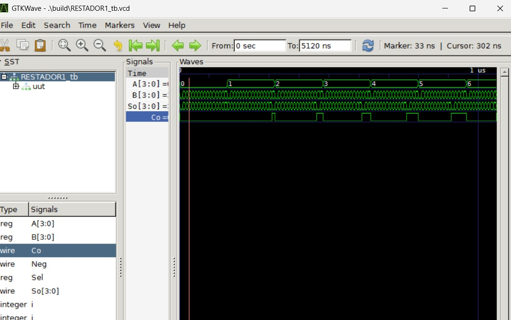
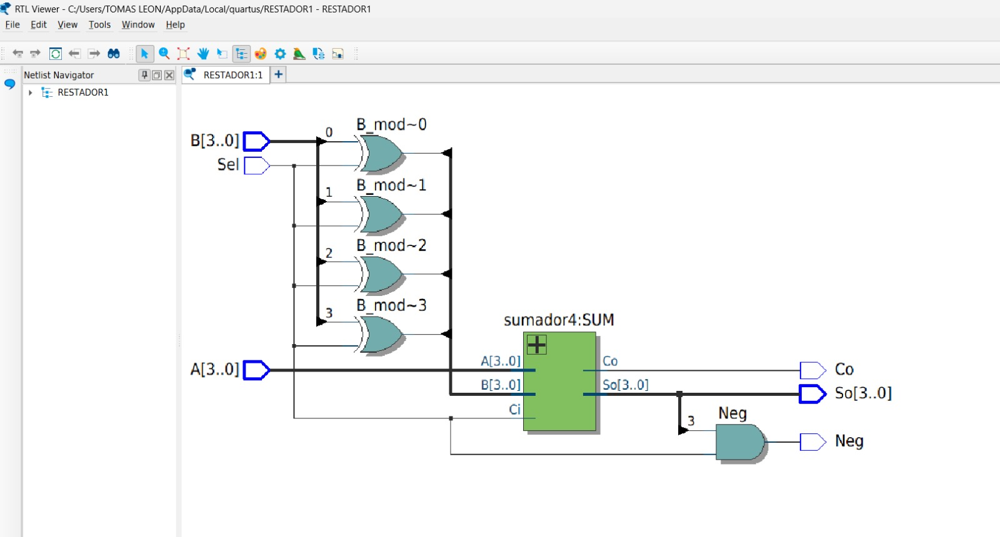
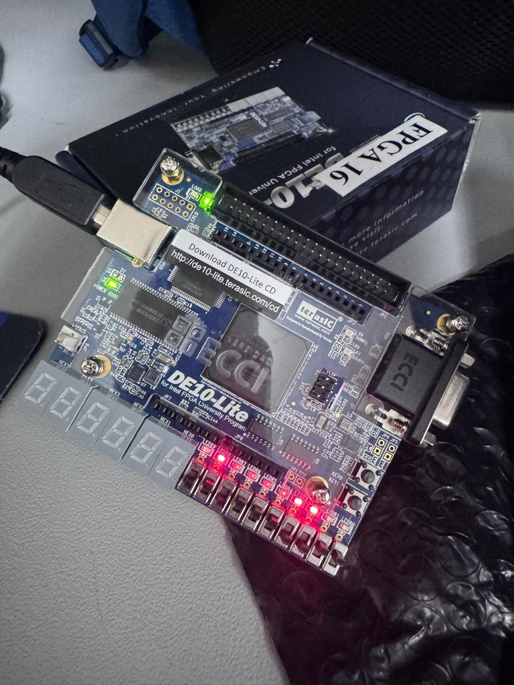
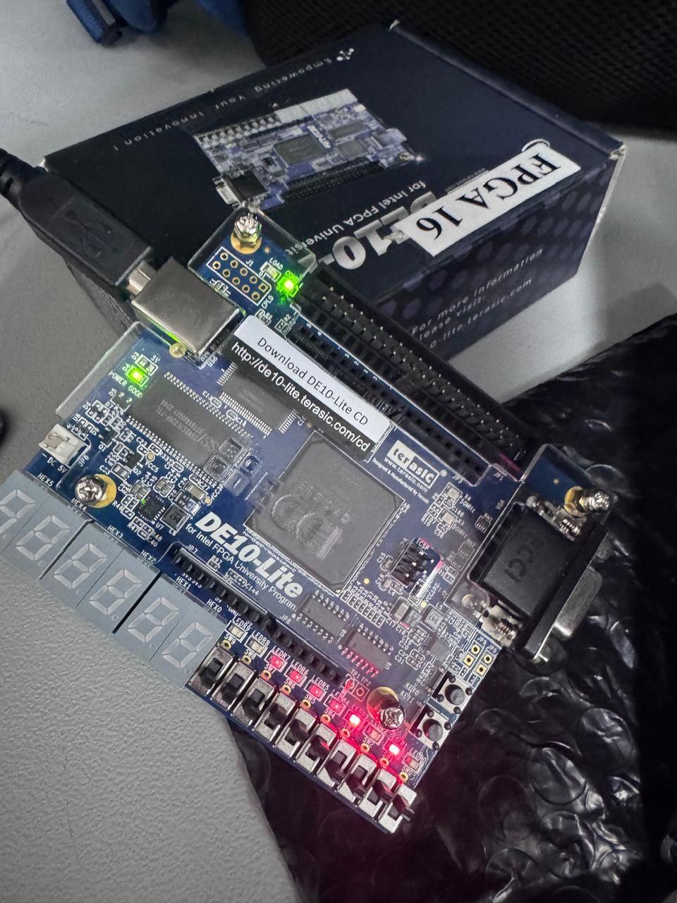
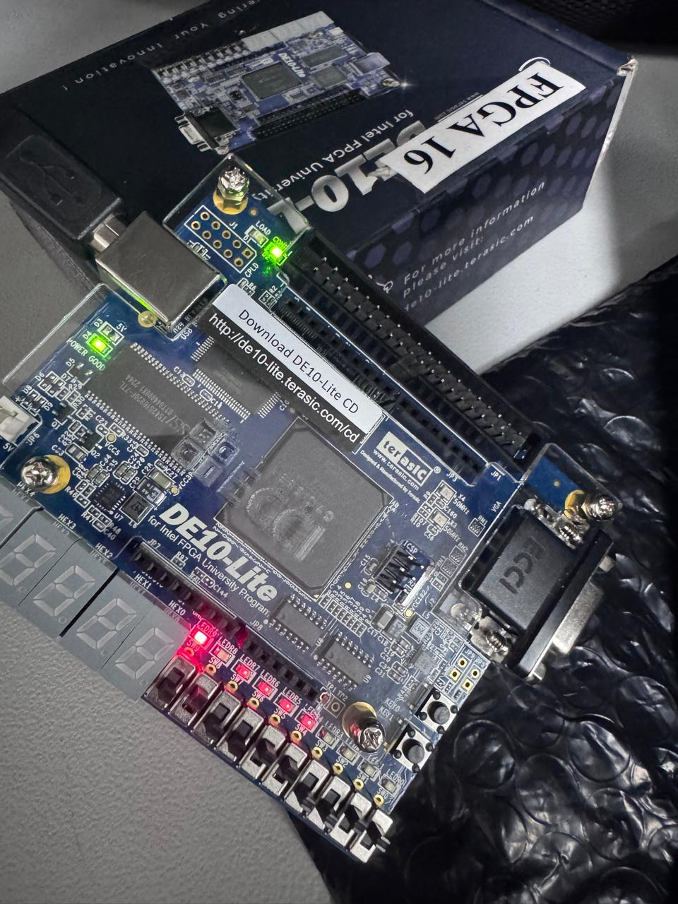

# Lab02 - Sumador/Restador de 4 bits

# Integrantes
[Wilmar Andrey Gil Cupacan](https://github.com/wilmarandreygc10-maker)
[Tomas Camilo Leon Torres](https://github.com/tomascleont-commits)
# Informe

Indice:

1. [Documentación](#documentación-de-los-circuitos-implementados-implementado)
2. [Simulaciones](#simulaciones)
3. [Evidencias de implementación](#evidencias-de-implementación)
4. [Preguntas](#preguntas)
5. [Conclusiones](#conclusiones)
6. [Referencias](#referencias)

## Documentación del diseño implementado

### 1. Sumador/Restador

#### 1.1 DescripciónEn el presente laboratorio se diseñó e implementó un circuito sumador/restador de 4 bits empleando el método del complemento a 2.

El diseño se fundamenta en la reutilización de un sumador binario previamente desarrollado, al cual se le añadieron compuertas lógicas, permitiendo seleccionar entre operaciones de suma y resta.

Cuando la señal Sel = 0, el circuito realiza la operación:

𝐴
+
𝐵
A+B

Debido a que las compuertas XOR permiten el paso directo de la señal 
𝐵
B.

Cuando la señal Sel = 1, el circuito ejecuta la operación:

𝐴
−
𝐵
A−B

Esto ocurre porque:

Las compuertas invierten los bits de 
𝐵
B, generando el complemento a 1.

La misma señal Sel se conecta al acarreo inicial del primer sumador, añadiendo el +1 necesario para obtener el complemento a 2.

De esta manera, la resta se transforma en una suma binaria, simplificando el diseño del hardware.

El sistema está compuesto por:

Cuatro sumadores completos de 1 bit conectados en cascada.

Cuatro compuertas XOR para el control del sustraendo.

Una señal de control de operación.

Propagación de acarreo tipo Ripple Carry.

El bit de acarreo final permite interpretar si el resultado es positivo o negativo.

## Simulaciones 

### 1. Simulación del sumador/restador
Foto simulacion restador 

#### 1.1 Descripción
Modo suma (Sel = 0):
B_mod = B

Ci = 0

Salida = A + B

Modo resta (Sel = 1):
B_mod = complemento de B (invertido)

Ci = 1

Esto efectúa: A +(complemento de B)+1=A+(2n−B)=A+(16−B)
A+(complemento de B)+1=A+(2 
n
 −B)=A+(16−B)
Pero en aritmética de complemento a 2, esto es equivalente a A – B.
#### 1.2 Diagrama
Foto del diagrama 

Entradas:
A[3..0] : Número A de 4 bits.

B[3..0] : Número B de 4 bits.

Sel : Señal de selección de operación.

Sel = 0 → Suma (A + B)

Sel = 1 → Resta (A – B)

Bloque intermedio:
B_mod~0 a B_mod~3 : Son las salidas de un arreglo de compuertas XOR con una entrada conectada a Sel y la otra a cada bit de B.

Cuando Sel = 0 → B_mod = B (sin cambios).

Cuando Sel = 1 → B_mod = complemento de B (B invertido bit a bit).

Sumador de 4 bits:
Entradas:

A[3..0]

B_mod[3..0] (B o su complemento)

Ci (acarreo de entrada) = Sel

Sel = 0 → Ci = 0 (suma normal)

Sel = 1 → Ci = 1 (completa el complemento a 2 para la resta)

Salidas:

So[3..0] : Resultado de 4 bits.

Co : Acarreo de salida.

Neg : Posible indicador de resultado negativo (puede derivarse de Co o de un comparador).

## Evidencias de implementación
Primer caso 

Segundo caso 

Tercer caso

## Conclusiones
1.  **Validación del Método de Complemento a 2:** La implementación exitosa del circuito valida la eficiencia y robustez del método del complemento a 2 para realizar operaciones de resta utilizando únicamente hardware sumador. Se comprobó que la lógica "A + (complemento a 2 de B)" reproduce correctamente la operación aritmética A - B.

2.  **Funcionamiento Correcto de la Lógica de Control:** La estrategia de utilizar compuertas **XOR** y la señal de control **Sel** para manipular tanto el sustraendo (B) como el acarreo inicial (Ci) demostró ser perfectamente funcional.
    *   Con **Sel=0**, las compuertas actuaron como buffers y el acarreo inicial fue 0, ejecutando una suma convencional (A + B).
    *   Con **Sel=1**, las compuertas invirtieron los bits de B (complemento a 1) y, junto con el acarreo inicial de 1, se generó el complemento a 2 de B, efectuando así la resta (A - B).

3.  **Eficiencia en el Diseño (Reutilización de Hardware):** El diseño cumple con el objetivo de minimizar la complejidad del hardware. Se logró implementar una nueva funcionalidad (la resta) simplemente añadiendo compuertas XOR a un sumador binario ya existente. Esto demuestra un principio fundamental del diseño digital: la reutilización de bloques lógicos para crear circuitos más versátiles.

4.  **Comportamiento del Acarreo y Detección de Desbordamiento:** Se observó el comportamiento del acarreo de salida (**Co**) como un indicador crucial.
    *   En la **suma**, un acarreo de salida igual a 1 indica un desbordamiento (overflow), señalando que el resultado es mayor que el máximo representable con 4 bits (15).
    *   En la **resta**, el acarreo de salida funcionó como un bit de signo. Un acarreo final de 1 indicó un resultado positivo (A ≥ B), mientras que un acarreo final de 0 indicó un resultado negativo (A < B), requiriendo en este último caso una interpretación del resultado en complemento a 2.

5.  **Comprensión del Ripple Carry:** La implementación práctica permitió comprender el funcionamiento de la propagación de acarreo en configuración "Ripple Carry". Se verificó que el resultado de cada bit depende del acarreo generado en la etapa anterior, lo que, si bien es funcional para 4 bits, introduce retardos que podrían ser limitantes en sistemas más complejos.

6.  **Cumplimiento de los Objetivos del Laboratorio:** El circuito implementado satisface todos los requisitos planteados inicialmente. Se construyó un sistema aritmético lógico (ALU) básico capaz de conmutar entre suma y resta de números de 4 bits, confirmando su correcto funcionamiento a través de la verificación práctica de todas las combinaciones de entrada relevantes.

## Referencias
[1] M. M. Mano, *Diseño Digital*, 3a ed. Naucalpan de Juárez, México: Pearson Educación, 2003. 

[2] CircuitVerse.org, "Sumador o restador binario con salida representada en complemento A2 (4 bits)," 2021. [En línea]. Disponible: https://circuitverse.org/users/75038/projects/sumador-o-restador-binario-con-salida-representada-en-complemento-a2-4-bits. [Accedido: 15-mar-2026]. 

[3] Scribd, "Circuito Restador de 4 Bits," 2018. [En línea]. Disponible: https://es.scribd.com/document/390515915/Informe-de-Laboratorio-de-Restador-de-4-bits. [Accedido: 15-mar-2026]. 
